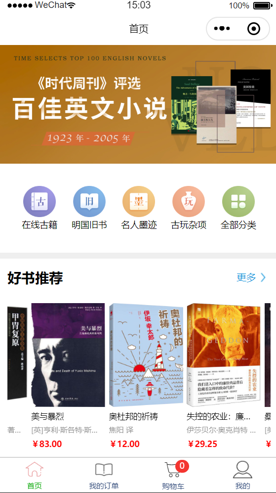
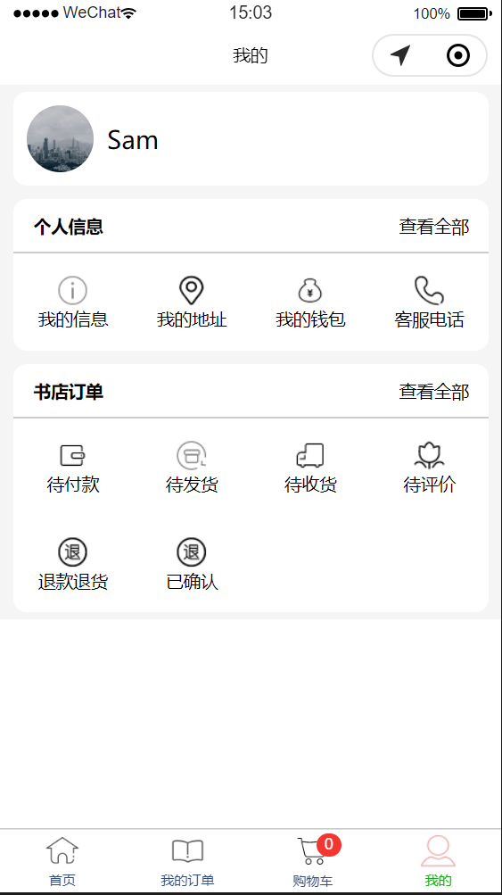
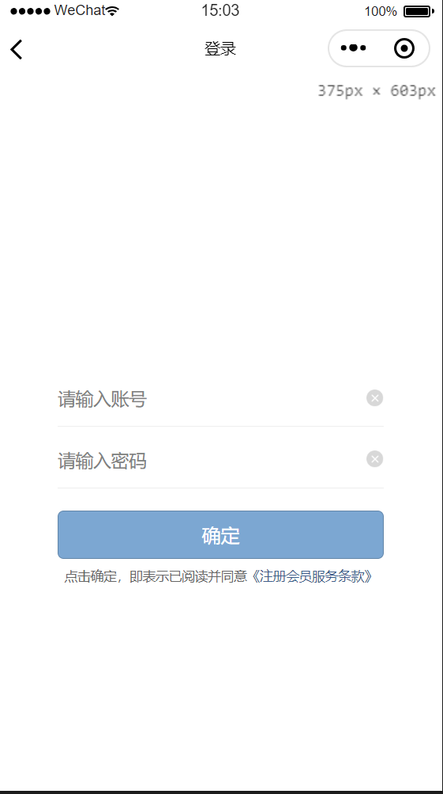
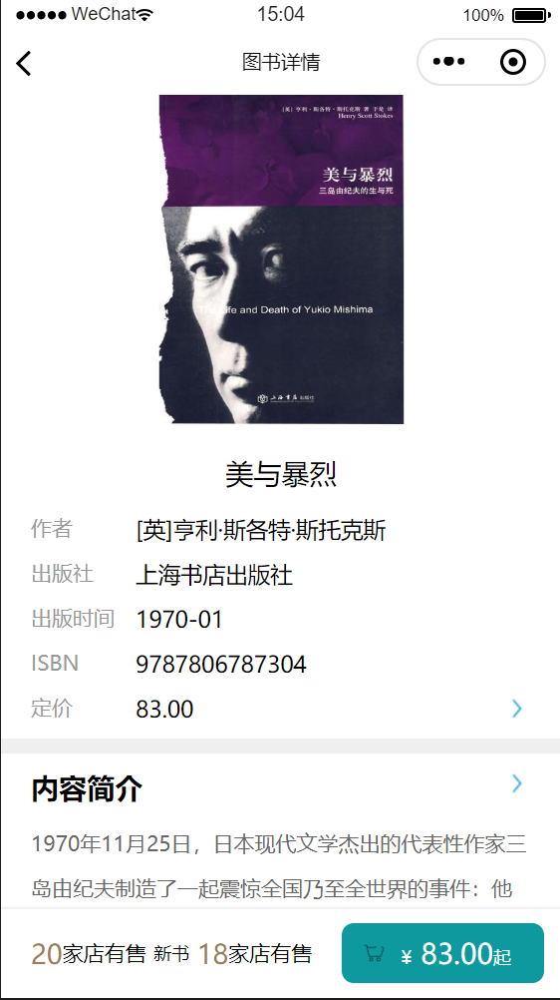
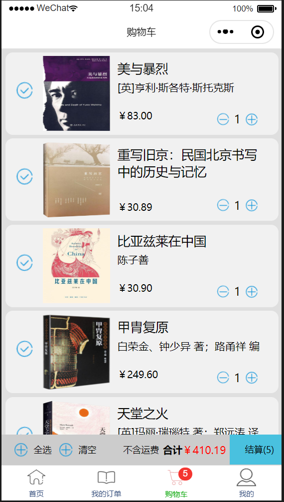
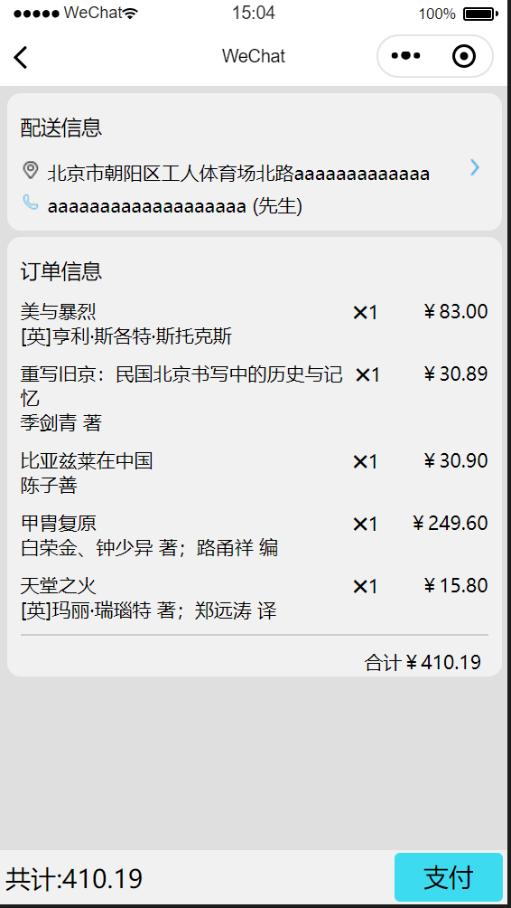
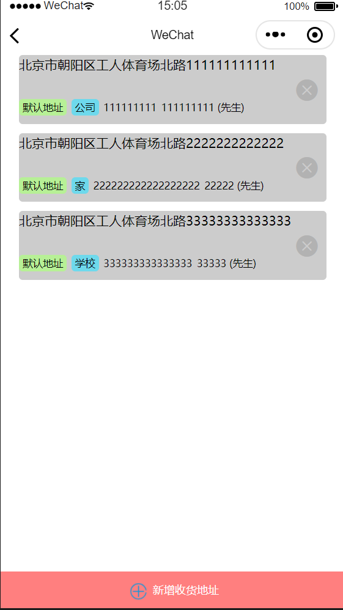
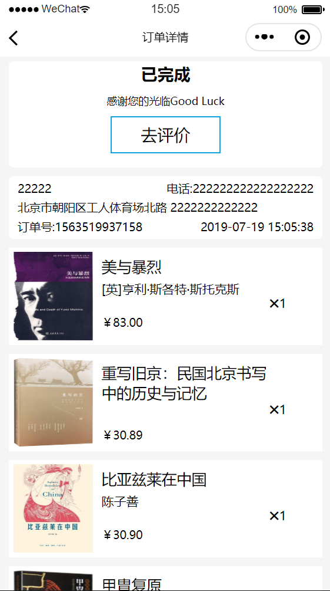

## 温馨提示 ：  好书推荐数据模块， 他妈的数据经常变。所以我这边改了又改。如果没有好书推荐 自行查看数据返回

## currPage1 数据--->
 if(dataId === 27){
    今日上新
    书店排行榜
  }else if(dataId === 28){
    新书频道
    藏书单
  }else if(dataId === 29 ){
    全部拍卖
    艺术品专场
    低价拍卖
  }

## currPage2 数据--->
  if(dataId === 24){
    好书推荐数据集合
  }else if(dataId === 30){
    珍本拍卖
    今日热点
  }else if(dataId === 31 ){
    大众拍卖
    三天热点
  }

## currPage3 数据--->
  if(dataId === 25){
    新书广场数据集合
  }else if(dataId === 32){
     书单推荐数据集合
  }else if(dataId === 33 ){
    旧书-国学经典数据集合
  }

## currPage4 数据--->
  if(dataId === 33){
    旧书-国学经典数据集合
  }else if(dataId === 26){
     "新书-新近出版"
  }else if(dataId === 44 ){
      "新书销售排行榜"
  }

## 这个项目是我个人一直想要做的一个前端后端都有的一个项目，其中用node+mongo 实现服务器 
    小程序端：   一个简单的图书小程序
    后台端：    打造为一个记录用户数据的一个后台管理系统，目前技术栈主要为Vue Vuex axios elementui 等
    服务端：    node + mongodb 实现

